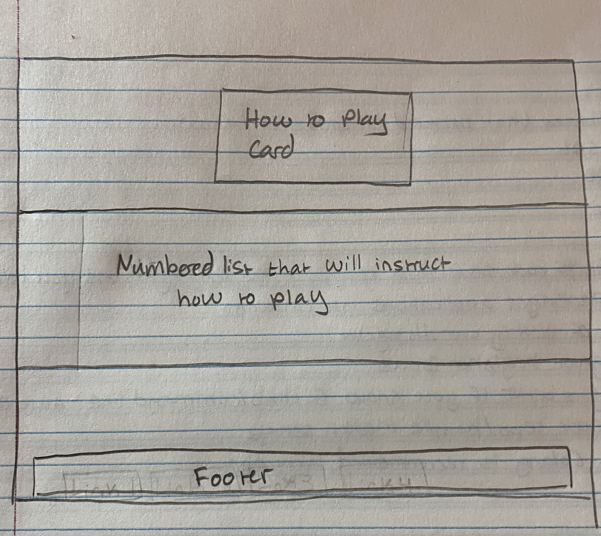

### project-bravo

**Date**: 10/13/2025

**Author**: Maria Dukes

## Game Objective

Place the berry into its matching basket, until you've done 4/4.

## Rules

1. Enter player name
2. Drag each berry into it's matching basket 
3. Your score will be kept
4. Reset the game afterw inning or needing to retry

## Easter Egg

Open console and type in game.theme()

## Tech Used

- HTML5: Skeleton and layout
- CSS3: Style and unique properties
- Boostrap 5: Card, Navbar, buttons, etc.
- JavaScript: jQuery, drag and drop, validation, cookies, etc.
- GutHub Pages: Live link and hosting

## Wireframe



## Code Snippet

```js
export function setCookie(name, value, days = 365) {
  const date = new Date();
  date.setTime(date.getTime() + days * 24 * 60 * 60 * 1000);
  const expires = "expires=" + date.toUTCString();
  document.cookie = `${name}=${encodeURIComponent(value)}; ${expires}; path=/`;
}

export function getCookie(name) {
  const decoded = decodeURIComponent(document.cookie);
  const cookies = decoded.split(';');
  for (let c of cookies) {
    c = c.trim();
    if (c.startsWith(name + '=')) {
      return c.substring(name.length + 1);
    }
  }
  return null;
}
```
Stores infromation such as name and value along with an expiration date. Saves the cookie onto the browser for website and will remember even after a refresh.

The second block of javascript reads all the cookies, splits and matches them, before returning them.

## Resource Links

- Live Link:
- GitHub Link:
- Nu Validator:
- Wave Link: 


## Known Omissions

- Section headings would disrupt how I planned out for the visuals of the page
- Trouble with inputing alerts from incorrect input and relied on built in browser pop-ups

## Credit & Disclosure

- CodeAcademy (Grid and animation)
- StackOverFlow (js & jQuery)
- W3Schools
- ChatGPT-5 (Error review/handling)

- [Advanced Selectors](https://www.geeksforgeeks.org/css/advanced-selectors-in-css/)
- [Set/Get Cookie](https://stackoverflow.com/questions/14573223/set-cookie-and-get-cookie-with-javascript)
- [Get Cookie by Name](https://stackoverflow.com/questions/10730362/get-cookie-by-name)
- [Custom Properties](https://developer.mozilla.org/en-US/docs/Web/CSS/CSS_cascading_variables/Using_CSS_custom_properties)
- [HTML Forms](https://www.w3schools.com/html/html_forms.asp)
- [If Else in jQuery](https://stackoverflow.com/questions/4520042/if-else-else-if-in-jquery-for-a-condition)
- [Client-Side validation](https://www.youtube.com/watch?v=rsd4FNGTRBw)


